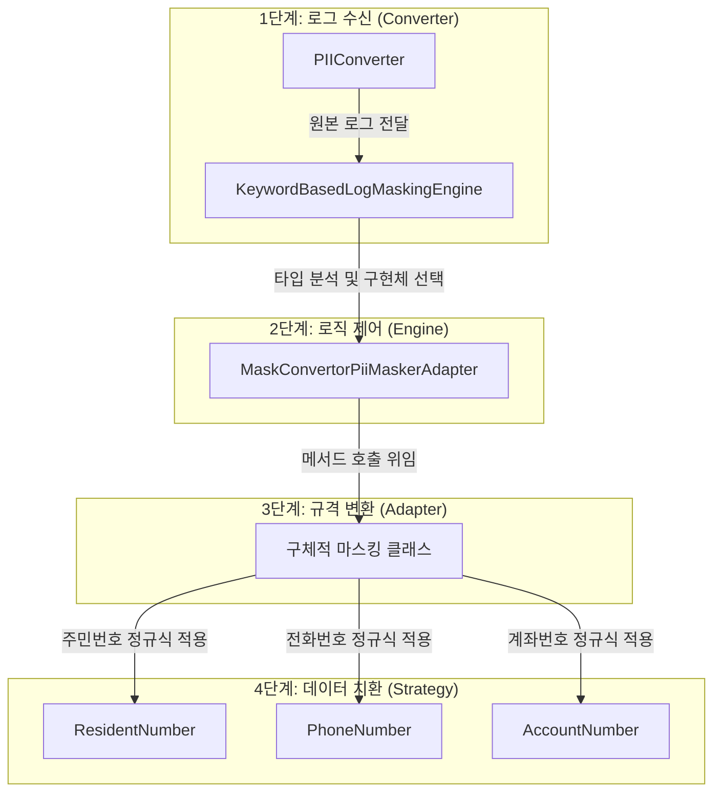

# [우리 FIS 아카데미 6기] Logback PII Masking Module (Log-Masker)

> **금융권 프로젝트를 위한 개인정보(PII) 자동 마스킹 로그백 모듈**<br>
> **"보안은 선택이 아닌 필수입니다."**<br>
> 이 모듈은 개발자가 비즈니스 로직에서 별도의 마스킹 처리를 하지 않아도됩니다!<br>
> 저희 모듈을 사용하면, 로그가 기록되는 시점에 자동으로 민감 정보(주민번호, 계좌번호 등)를 감지하여 마스킹 처리합니다.

## 프로젝트 설명

금융 시스템 개발 과정에서 로그에 남는 민감 정보(PII: Personally Identifiable Information)는 보안 취약점이 될 수 있습니다.
이 프로젝트는 **Logback** 프레임워크를 확장하여, 로그 메시지 내의 민감 정보를 정규식(Regex) 기반으로 탐지하고 마스킹(Masking)하는 커스텀 컨버터입니다.

단순한 기능 구현을 넘어, 객체지향 설계 원칙(SOLID)을 준수하고 디자인 패턴(Adapter, Strategy, Factory 등)을 실무에 적용하여 유지보수성과 확장성을 높이는 데 주력했습니다.

### ✨ 핵심 기능

* **원활한 통합**: 기존 `logback.xml` 설정에 한 줄만 추가하면 즉시 적용 가능.
* **다양한 타입 지원**: 주민등록번호, 휴대폰 번호, 계좌번호, 카드번호 등 다양한 PII 타입 지원.
* **디자인 패턴**: 전략 패턴과 어댑터 패턴을 적용하여 새로운 마스킹 정책 추가 용이.
* **키워드 감지**: 키워드 기반 감지 (`ssn`, `mobile` 등) 및 금지어 정책 설정 가능.

---

## 🚀 시작하기

이 모듈을 프로젝트에 적용하는 빠르고 간단한 방법입니다.

### Prerequisites

* Java 17+
* Spring Boot (or pure Logback dependency)
* logback-classic-1.4.5.jar
* logback-core-1.4.5.jar
* slf4j-api-2.0.17.jar

### Installation

1. 프로젝트를 클론하고 빌드하여 JAR 파일을 생성합니다.

```shell
git clone https://github.com/fluanceifi/log-masking-module.git
cd log-masking-module

# 저희는 자바자체로만 구현하여 빌드 툴을 사용하진 않았습니다.
./gradlew clean build
```

2. 생성된 JAR를 로컬 라이브러리로 추가하거나, 소스 코드를 프로젝트 패키지에 포함시킵니다.

### Configuration (`logback.xml`)

1. resources 디렉토리에서 logback.xml 파일을 생성합니다.

2. Logback 설정 파일에 `conversionRule`을 등록하여 마스킹 컨버터를 활성화합니다.

```xml
<configuration>
    <conversionRule conversionWord="msg" 
                    converterClass="strategy.masking.PIIConverter" />

    <appender name="STDOUT" class="ch.qos.logback.core.ConsoleAppender">
        <encoder>
            <pattern>%d{HH:mm:ss.SSS} [%thread] %-5level %logger{36} - %msg%n</pattern>
        </encoder>
    </appender>

    <root level="INFO">
        <appender-ref ref="STDOUT" />
    </root>
</configuration>

```
### practice

아래와 같이 기존 코드를 작성하는 것처럼 똑같이 사용하시면 됩니다.

```Java
package test;

import org.slf4j.Logger;
import org.slf4j.LoggerFactory;

public class ConveterTest {

	private static final Logger logger = LoggerFactory.getLogger(ConveterTest.class);
	public static void main(String[] args) {
		// TODO Auto-generated method stub
		logger.info("mobile: 010-9999-8888, card=1234-5678-1234-5678");
	}

}

```

```console
17:47  [34m[INFO ] [0;39m [main]  [36m[test.ConveterTest] [0;39m - mobile: 010-****-8888, card=1234-56**-****-5678

```

---

## ⚙️ 시스템 동작 흐름 (Top-Down)

이 모듈은 로그가 기록되는 시점부터 실제 마스킹 처리가 완료되기까지, **계층별로 명확히 분리된 역할**을 수행합니다.

### 1. 로그 이벤트 수신 및 진입 (Converter Layer)

`PIIConverter`는 Logback 프레임워크와 본 모듈을 연결하는 진입점입니다.

* 애플리케이션에서 로그 출력 요청이 발생하면, Logback의 `ClassicConverter`를 상속받은 이 클래스가 실행됩니다.
* 원본 로그 메시지를 수신하여 하위 레이어인 마스킹 엔진으로 전달합니다.

### 2. 마스킹 대상 탐지 및 로직 제어 (Engine Layer)

`KeywordBasedLogMaskingEngine` 은 마스킹 프로세스를 총괄하는 컨트롤러입니다.

* 전달받은 로그 메시지 내에 사전(Dictionary)에 등록된 민감 정보 키워드(예: `ssn`, `mobile`)가 존재하는지 분석합니다.
* 키워드가 탐지되면, 해당 데이터 타입 처리에 적합한 구현체를 매핑하여 호출합니다.

### 3. 인터페이스 호환성 어댑터 (Adapter Layer)

`MaskConvertorPiiMaskerAdapter` 는 서로 다른 인터페이스 간의 호환성을 보장합니다.

* 엔진이 사용하는 `PiiMasker` 인터페이스와 실제 로직이 구현된 `MaskConvertor` 인터페이스 사이를 연결합니다.
* 이를 통해 엔진은 구체적인 구현 클래스의 내부 구조를 알 필요 없이 통일된 방식으로 마스킹을 요청할 수 있습니다.

### 4. 정규식 기반 문자열 치환 (Strategy Layer)

최하위 레이어에는 `ResidentNumber`, `PhoneNumber` 등 구체적인 데이터 처리 클래스가 위치합니다.

* 각 클래스는 해당 개인정보 유형에 특화된 **정규표현식(Regex)**과 치환 로직을 캡슐화하고 있습니다.
* 상위 레이어의 요청에 따라 실제 문자열을 가공하여 마스킹된 결과값을 반환합니다.


---

## 🛠 개발과정

이 프로젝트의 구조를 이해하고 기능을 확장하고 싶은 개발자를 위한 가이드입니다.

### Project Structure

```text
src/
├── strategy/masking/
│   ├── PIIConverter.java                   # Entry Point (Logback 연동)
│   ├── AccountNumber.java                  # 마스킹 알고리즘 (Strategy Pattern)
│   ├── PhoneNumber.java
│   ├── PrimaryAccountNumber.java            # 카드
│   ├── ResidentNumber.java
│   ├── MaskConvertor.java                  # 마스킹 전략 인터페이스
│   └── MaskConvertorPiiMaskerAdapter.java  # 인터페이스 변환 (Adapter Pattern)
├── core/
│   ├── KeywordBasedLogMaskingEngine.java   # 마스킹 로직 제어
│   ├── PiiMasker.java                      # 마스킹 인터페이스
│   └── PiiType.java                        # PII 타입 enum
├── dictionary/
│   ├── PiiKeywordDictionary.java           # 키워드 사전
│   └── ForbiddenKeywordPolicy.java         # 금지어 정책
└── util/
    └── StringUtils.java                    # 유틸리티

```

### 적용된 디자인 패턴

이 프로젝트는 다음과 같은 디자인 패턴을 활용하여 설계되었습니다.

1. **Adapter Pattern (`MaskConvertorPiiMaskerAdapter`)**
* 서로 다른 인터페이스인 `MaskConvertor`와 `PiiMasker`를 연결하여 호환성 확보.


2. **Strategy Pattern (`PiiMasker`)**
* 주민번호, 계좌번호 등 마스킹 대상에 따라 서로 다른 알고리즘을 런타임에 교체하여 사용.


3. **Static Factory Method**
* 설정 파일이나 기본값으로부터 객체를 생성하는 로직을 캡슐화.


---

## ⚙️ Configuration Details

마스킹 동작 방식을 커스터마이징 할 수 있는 설정입니다.

### 기본 키워드 사전

기본값으로 다음 키워드들이 지원됩니다:

| Keyword | Type | Description | Example |
| --- | --- | --- | --- |
| `ssn`, `resident` | RRN | 주민등록번호 패턴 감지 (######-#######) | `990101-1******` |
| `phone`, `mobile` | PHONE | 휴대폰 번호 패턴 감지 (010-xxxx-xxxx) | `010-1234-****` |
| `account` | ACCOUNT | 계좌번호 패턴 감지 | `123-45-******` |
| `card` | CARD | 신용카드 번호 패턴 감지 | `1234-****-****-1234` |

### 커스텀 키워드 사전 사용

사용자가 `resources/masking-keywords.properties` 파일을 생성하여 커스텀 키워드를 추가할 수 있습니다.

**Properties 파일 형식:**
```properties
# PII 키워드 사전. 왼쪽=PiiType 이름(rrn|phone|account|card), 오른쪽=로그 key로 쓸 alias 목록(콤마 구분)
rrn=rrn,residentNo,residentNumber,jumin,ssn_kr
phone=phone,mobile,tel,contact,msisdn
account=account,acct,accountNo,bankAccount,withdrawAccount,depositAccount
card=card,cardNo,cardNumber,pan
```

**동작 방식:**
- `PIIConverter`는 시작 시 `resources/masking-keywords.properties` 파일을 우선적으로 로드합니다.
- 파일이 없거나 로드에 실패하면 기본 키워드 사전을 사용합니다.

## 🛠️ 리팩토링(예외 처리)

👎 **[코드] 개선 전:**

```java
		@Override
    public String convert(String target) {
        if (target == null || target.isBlank()) {
            return target;
        }

        // "950101-1234567" 형태의 주민번호를 "950101-1******"로 마스킹
        if (target.matches("\\d{6}-\\d{7}")) {
            return target.substring(0, 8) + replacement;
        }

        return target;
    }
```

- 기존 코드는 부적절한 입력값이 전략 클래스에 매개변수로 들어왔습니다.
- 따라서 예외가 발생해도 입력값을 그대로 반환해 주는 형식으로 동작하였습니다.

👎 **[단위 테스트]개선 전:**

```java
// 이것도 마찬가지로 예외를 던져야함. 근데 예외를 하나로 통일할까?
	@Test
	@DisplayName("[실패케이스] 실패 & 예외 케이스 ")
	void 실패_혹은_예외_4가지_테스트() {

		assertAll(
				// 케이스 1: 하이픈(-)이 없는 경우
				() -> assertEquals(rm1.convert("9501011234567"), "9501011234567"),
				
				// 케이스 2: 자릿수가 부족한 경우
				() -> assertEquals(rm1.convert("950101-123456"), "950101-123456"),

				// 케이스 3: 자릿수가 초과된 경우
				() -> assertEquals(rm1.convert("950101-12345678"), "950101-12345678"),

				// 케이스 4: 숫자가 아닌 문자가 포함된 경우
				() -> assertEquals(rm1.convert("950101-abcdefg"), "950101-abcdefg"));
				}));
	}
```

- 단위 테스트를 작성하면서 분명 실패 케이스인데, **“이렇게 Equals로 확인만 하는게 맞는건가?”** 라는 생각이 들었습니다.
- 그래서 외부 요인에 의해 실패한 상황에 대해선 **“예외처리를 해줘야겠다!”** 라고 인지하여 수정을 하게되었습니다.

👍 **[코드] 개선 후:**

```java
@Override
	public String convert(String target) {
		// null, " "
		if (target == null || target.isBlank()) {
			throw new IllegalArgumentException("유효하지 주민등록번호 형식입니다. 입력값: " + target);
		}

		// 정규식에 맞지 않으면 예외 발생 (하이픈 없음, 길이 안 맞음, 뒷자리 1~8 아님 등 모두 포함)
		// 정규식 설명: 앞6자리 숫자 + 하이픈 + 뒷자리 첫글자(1~8) + 뒷자리 나머지 6개
		if (!target.matches("\\d{6}-[1-8]\\d{6}")) {
			throw new IllegalArgumentException("유효하지 않은 주민등록번호 형식입니다. 입력값: " + target);
		}

		// "950101-1234567" 형태의 주민번호를 "950101-1******"로 마스킹
		if (target.matches("\\d{6}-\\d{7}")) {
			return target.substring(0, 8) + replacement;
		}

		return target;
	}
```

- **“어떤 예외를 사용할까?”** 고민하던 중 다른 전략을 추가할 때 재사용성과 유연성을 위해 **`IllegalArgumentException.class`** 를 사용하였습니다.
- 따라서 예외처리 메세지 규격만 통일하면 되도록하였습니다.

👍 **[단위 테스트]개선 후:**

```java
// 이것도 마찬가지로 예외를 던져야함. 근데 예외를 하나로 통일할까?
	@Test
	@DisplayName("[실패케이스] 실패 & 예외 케이스 ")
	void 실패_혹은_예외_4가지_테스트() {

		assertAll(
				// 케이스 1: 하이픈(-)이 없는 경우
				() -> assertThrows(IllegalArgumentException.class, () -> {
					rm1.convert("9501011234567");
				}),
				// 케이스 2: 자릿수가 부족한 경우
				() -> assertThrows(IllegalArgumentException.class, () -> {
					rm1.convert("950101-123456");
				}),
				// 케이스 3: 자릿수가 초과된 경우
				() -> assertThrows(IllegalArgumentException.class, () -> {
					rm1.convert("950101-12345678");
				}),
				// 케이스 4: 숫자가 아닌 문자가 포함된 경우
				() -> assertThrows(IllegalArgumentException.class, () -> {
					rm1.convert("950101-abcdefg");
				}));
	}
```

- 이렇게 외부 요인에 의해서 잘못된 행위를 체크 예외 처리하였습니다.
- 하지만 예외를 생성하기만하면 프로그램이 뻗게됩니다.
- 이제 전략 클래스를 사용하는 어댑터 클래스에서 **`try-catch`** 로 잡아 던져줘야합니다.

👍 **[코드] 수정된 어댑터 클래스:**

```java
@Override
    public String mask(String value) {
        try {
            // 1. 엄격한 변환 시도 (여기서 실패하면 IllegalArgumentException 발생)
            return delegate.convert(value);
        } **catch (IllegalArgumentException e)** {
            // 2. [실패 시 처리 정책]
            // 예외가 발생했다는 것은 포맷이 맞지 않는 데이터라는 뜻입니다.
            
            // 옵션 A: 원본을 그대로 반환 (디버깅 용이, 민감정보 노출 위험 있음)
            return value; 
            
            // 옵션 B: 에러 태그 반환 (가장 안전, 추천 ⭐)
            // return String.format("[%s_FORMAT_ERROR]", type.name());
        } catch (Exception e) {
            // 3. 예상치 못한 그 외 에러 방어
            return "[MASKING_ERROR]";
        }
    }
```

```java
public class IllegalArgumentException extends RuntimeException
```

- 이런식으로 `IllegalArgumentException` 을 이용하여 `try-catch` 처리하였습니다.

---

## 🤝 Contributing

기여는 언제나 환영합니다! 버그 제보, 기능 제안, PR 모두 감사합니다.

1. Fork the Project
2. Create your Feature Branch (`git checkout -b feature/AmazingFeature`)
3. Commit your Changes (`git commit -m 'Add some AmazingFeature'`)
4. Push to the Branch (`git push origin feature/AmazingFeature`)
5. Open a Pull Request

---

## 🏛️ 소속: [우리 FIS 아카데미]
[](https://github.com/woorifisa-service-dev-6th)
---

## 📝 License

Distributed under the MIT License. See `LICENSE` for more information.

---

## 👥 Contributors

| Name | GitHub Profile |
| :---: | :--- |
| **박찬혁** | [@PetterChanHyuk](https://github.com/PetterChanHyuk) |
| **전시원** | [@siiion](https://github.com/siiion) |
| **유승준** | [@fluanceifi](https://github.com/fluanceifi) |
| **김동욱** | [@aransword](https://github.com/aransword) |
